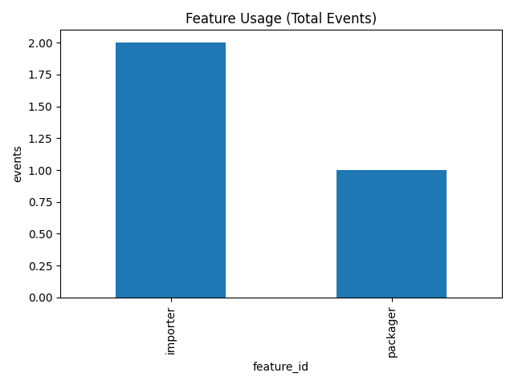

# Telemetry Dashboard — ingest → transform → report

[](https://github.com/jdawood1/telemetry-dashboard/actions)

Pipeline to ingest raw events, compute daily aggregates (events, DAU, optional p50/p95 latency), and generate charts + metrics.

## Run in 30 seconds

```bash
python -m venv .venv && source .venv/bin/activate
python -m pip install -r requirements.txt

python -m tlt.cli ingest --input sample/events.csv --out data/events.parquet
python -m tlt.cli transform --in data/events.parquet --out data/agg.parquet
python -m tlt.cli report --in data/agg.parquet --out reports/
```

**Outputs**
- `data/events.parquet` (raw events in parquet)
- `data/agg.parquet` (aggregated metrics)
- `reports/feature_usage.png`, `reports/metrics.txt`

### Sample Chart
Below is an example chart generated from the pipeline:



## Repo Structure
```
telemetry-dashboard/
  tlt/
    cli.py         # CLI entrypoint (Click)
    ingest.py      # CSV -> parquet
    transform.py   # aggregates (events, DAU, optional p50/p95)
    report.py      # charts + metrics
  sample/
    events.csv     # sample dataset
  tests/
    test_flow.py   # end-to-end test
  .github/workflows/ci.yml
  requirements.txt
  README.md
```

## Roadmap
- [ ] Add latency column to sample data and visualize p50/p95
- [ ] Add rolling 30d MAU
- [ ] Add per-feature latency distributions
- [ ] Add CSV/Parquet size comparisons

## License
MIT © 2025 John Dawood
